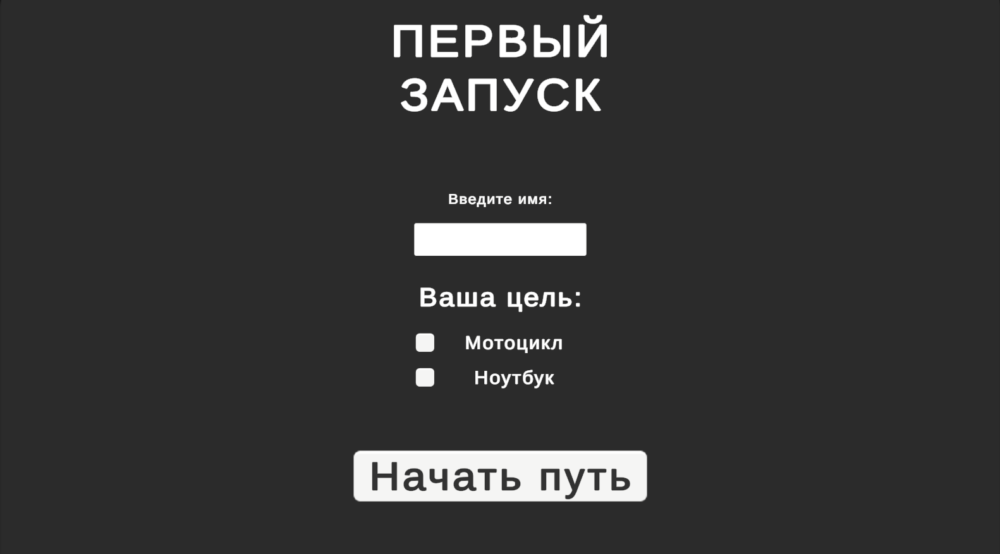
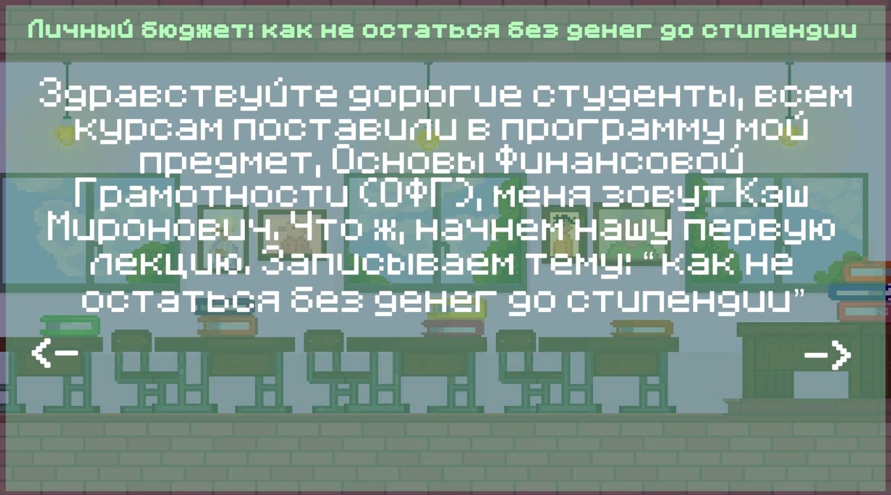

# 🏦 StudentsWallet

> **StudentsWallet** — удобное приложение для учета финансов студентов. Управляйте своими доходами и расходами, контролируйте бюджет и достигайте финансовых целей!

---

## 🚀 Возможности

- ✍️ Ведение записей о доходах и расходах
- 📊 Просмотр статистики и графиков
- 🎯 Постановка финансовых целей

---

## 📸 Скриншоты

---

## 📚 Технологии

- Unity2D

---

## 📬 Контакты

- Автор: [Frezoo](https://github.com/Frezoo)
- Telegram: [@lanskikh1](https://t.me/lanskikh1)
  
---
